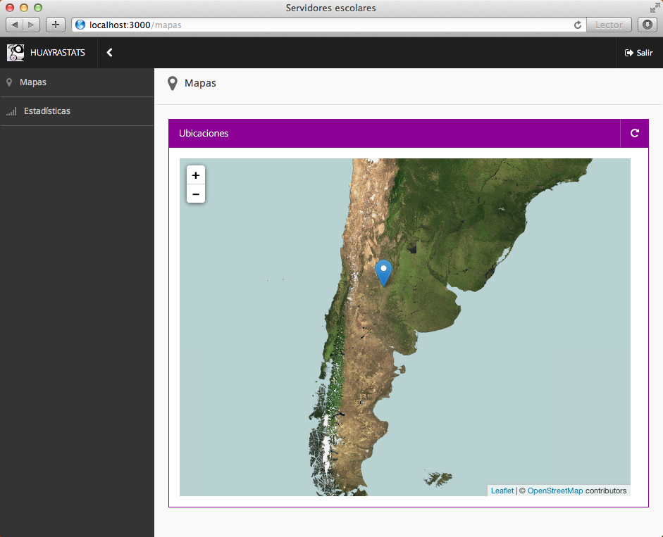

huayraStats
============

**huayraStats** es una aplicación que permite visualizar servidores
de la distribución linux Huayra distribuidos en Argentina.




API
---

<table>
	<tr>
		<th>Método</th>
		<th>URL</th>
		<th>Parámetros</th>
		<th>Descripción</th>
	</tr>
    <tr>
        <td>GET</td>
        <td>http://localhost:3000/api/puntos</td>
        <td>...</td>
        <td>Retorna todos los puntos del mapa en formato JSON.</td>
    </tr>
    <tr>
        <td>POST</td>
        <td>http://localhost:3000/api/puntos</td>
        <td>ip</td>
        <td>Reporta la posición de un equipo.</td>
    </tr>
    <tr>
        <td>POST</td>
        <td>http://localhost:3000/api/puntos</td>
        <td>lat, lng, contenido</td>
        <td>Reporta la posición de un equipo.</td>
    </tr>
</table>

Tener en cuenta, la llamada para notificar la posición de los equipos
se puede hacer de dos formas distintas.

**Ejemplos de invocación:**

Solicitar todos los puntos del mapa:

```
curl http://localhost:3000/api/puntos
```

Informar una conexión con todos los datos completos:


```
curl -d "lat=-34.428351&lng=-66.362915&contenido=Hola" http://localhost:3000/api/puntos
```

Informar una conexión pero solo espeficando la IP del equipo (huayraStats averiguará
la posición aproximada del equipo automáticamente):

```
curl -d "ip=190.2.11.125" http://localhost:3000/api/puntos
```
